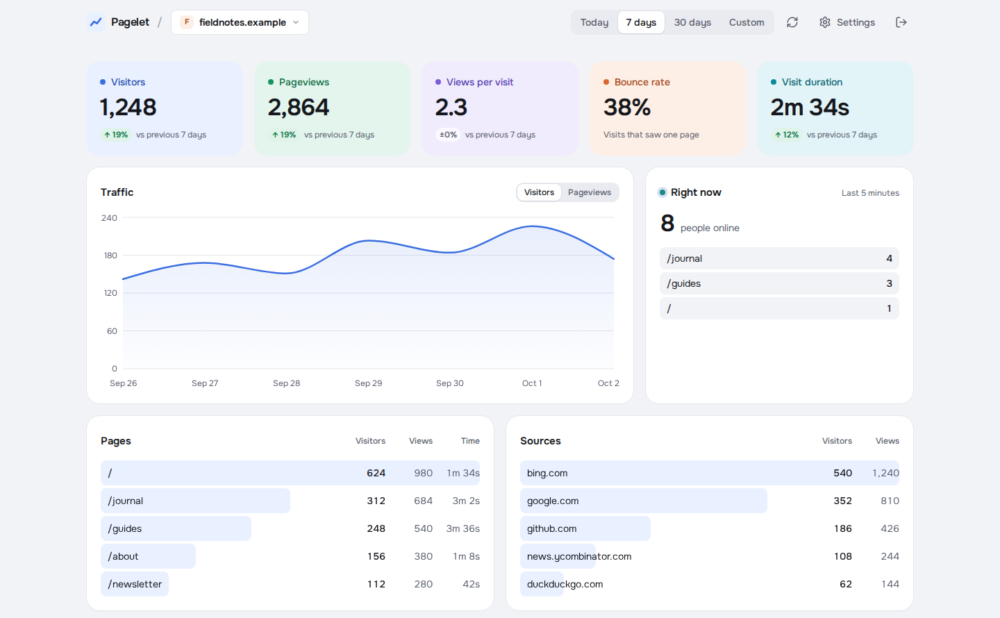

# Pagelet

Self-hosted, cookie-less web analytics in a single binary. Track visitors,
page views, custom events, and time on page across your websites.



*Dashboard with sample data.*

## Highlights

- **Simple to host.** One process and one DuckDB file. Run with Docker or
  a Linux binary; the dashboard is included.
- **Small tracker.** Under 4 KB, with automatic page views for single-page
  apps and custom events for actions such as signups.
- **Traffic and engagement.** Visitors, pageviews, bounce rate, visit
  duration, top pages, sources, countries, devices, and who is online now.
- **Several sites, one dashboard.** Works on desktop and mobile, with
  optional public dashboards you can share by link.

## Quickstart

Run with Docker on Linux amd64 or arm64. Replace `change-me` with your
own password:

```sh
docker run -d --name pagelet --restart unless-stopped \
  -p 8080:8080 \
  -v pagelet-data:/app/data \
  -e ADMIN_PASSWORD=change-me \
  ghcr.io/abogoyavlensky/pagelet:latest
```

The `pagelet-data` volume keeps your data across container updates.

Open [localhost:8080](http://localhost:8080), sign in with your password,
and add a site by its domain. For production, put Pagelet behind an HTTPS
reverse proxy, then add the tracking snippet to each page's `<head>`:

```html
<script defer src="https://analytics.example.com/p.js"></script>
```

Replace `analytics.example.com` with your Pagelet host. The dashboard
shows the snippet for your installation.

See [Getting started](docs/getting-started.md) for Linux binaries,
configuration, proxy setup, and updates.

## Privacy and limits

Tracked sites get no cookies. IP addresses and raw user agents are never
stored; visitor IDs change every UTC day and differ between sites.
The dashboard uses a sign-in cookie on the analytics host only.
See [what is collected](docs/tracking.md#what-is-collected).

- Reports are in your browser's time zone. A visitor returning on another day
  counts again.
- Time on page measures how long a page is visible, up to 30 minutes per
  stretch; it does not measure active interaction.
- Countries come from browser time zones, so they are approximate.
- One admin password; no separate user accounts.
- Data stays until you delete its site; there is no automatic retention.

## Documentation

- [Getting started](docs/getting-started.md): installation, configuration,
  HTTPS, and updates
- [Tracking](docs/tracking.md): script options, custom events, excluding
  your own visits, and collected data
- [Dashboard](docs/dashboard.md): metrics, public sharing, and installing as an app
- [Development](docs/development.md): source setup, UI workflow, and tests
- [Operations](docs/operations.md): image builds, releases, and hosted deployment

Built with [let-go](https://github.com/nooga/let-go),
[lgx](https://github.com/abogoyavlensky/lgx), and [DuckDB](https://duckdb.org).

## License

[MIT](LICENSE).
